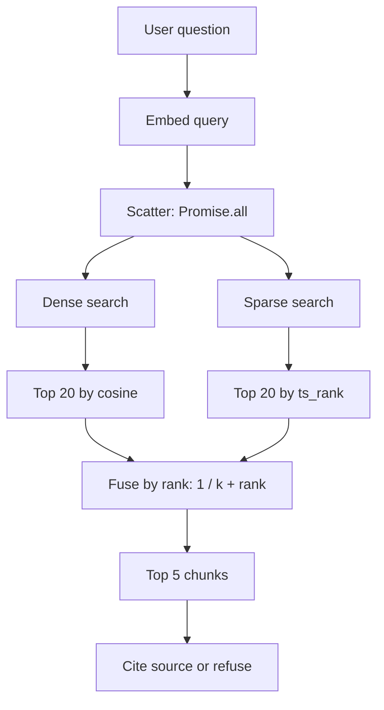

# Hybrid Search: Naive Vector Retrieval, and How to Fix It With Reciprocal Rank Fusion

> A step-by-step guide to adding PostgreSQL full-text search to a vector RAG pipeline and fusing two ranked result lists by rank instead of score.
>
> Repo: `verifiable-core` · Phase 9 · Stack: NestJS v10, Node 20+, Prisma, PostgreSQL with `pgvector`.

---

## What you need first

This guide **adds a hybrid retrieval layer to an existing pipeline**. It is not a from-zero build. Before you start you should already have:

- A NestJS + Prisma + PostgreSQL project wired to the `vector` (pgvector) extension.
- A `Document` table and a `DocumentChunk` table whose `embedding` column is **already populated** (your ingest → chunk → embed → store path is running).
- An embedding provider behind a small interface (called `provider` below, exposing `provider.dimensions` and `provider.embedText(text)`).
- A chat/LLM provider factory (called `this.chatFactory` below) used to generate the final answer.
- The shared types used below (`CandidateChunk`, `FusedChunk`), your `PrismaService`, and a `POST /chat` route.

If you already run a dense-vector RAG pipeline, you can add everything here in an afternoon. If you are starting from nothing, build the ingest → chunk → embed → store path first. This guide covers retrieval only.

---

## 1. The problem

A single-engine vector search looks correct in a demo and fails in production.

You embed every document chunk, store the vectors, and at query time return the nearest neighbors by cosine distance. It reads meaning well. It reads exact tokens badly. Embeddings compress a token like a function name, a fund code, an acronym, or an error string into the same high-dimensional blob as the words around it. The one chunk that contains the exact string sinks below five chunks that merely *sound* related. The model still receives context, still answers, and is still wrong.

Two more failure modes follow:

1. **Raw score arithmetic is undefined across legs.** If you add a semantic score to a keyword score, the two numbers are not on the same scale. Cosine similarity is bounded in `[0.0, 1.0]`. PostgreSQL `ts_rank` is unbounded and grows with document length. Adding them silently flattens the vector contribution.
2. **Hard similarity cutoffs drop recall.** A `WHERE similarity > 0.35` filter feels safe. For rare tokens the true match scores below the cutoff, so the only correct chunk is discarded before any rescuing leg can see it.

The fix is two retrieval legs, run in parallel, fused by **rank**:

- a **dense** leg (pgvector, cosine distance) for meaning;
- a **sparse** leg (PostgreSQL full-text search) for exact tokens;
- a fusion step that merges the two ranked lists with Reciprocal Rank Fusion (RRF).

---

## 2. Architecture



| Parameter | Value | Meaning |
|---|---|---|
| `CANDIDATE_LIMIT` | `20` | chunks returned per leg |
| `TOP_K_FINAL` | `5` | fused chunks sent to the model |
| `RRF_K` | `60` | RRF smoothing constant |
| `hnsw.ef_search` | `100` | HNSW recall/speed knob |
| HNSW `m` / `ef_construction` | `16` / `64` | index build parameters |

---

## 3. Prerequisites

- PostgreSQL with the `vector` extension (pgvector).
- Prisma with the `postgresqlExtensions` preview feature:

```prisma
generator client {
  provider        = "prisma-client-js"
  previewFeatures = ["postgresqlExtensions"]
}

datasource db {
  provider   = "postgresql"
  extensions = [vector]
}
```

- A `DocumentChunk` table that stores raw text alongside an untyped vector column:

```prisma
model DocumentChunk {
  id         String   @id @default(uuid())
  chunkIndex Int      @default(0)
  text       String   @db.Text
  documentId String
  document   Document @relation(fields: [documentId], references: [id], onDelete: Cascade)
  embedding  Unsupported("vector")?
  createdAt  DateTime @default(now())
  @@index([documentId])
}
```

---
## 4. Step 1 — The dense index (partial HNSW, per dimension)

Different embedding models produce different dimensions. Mixing `768` and `1536` embeddings in one index is undefined, so build one partial index per dimension and partition the query by `vector_dims`:

```sql
CREATE INDEX IF NOT EXISTS "DocumentChunk_embedding_hnsw_768_idx"
ON "DocumentChunk"
USING hnsw (((embedding)::vector(768)) vector_cosine_ops)
WITH (m = 16, ef_construction = 64)
WHERE (vector_dims(embedding) = 768);

CREATE INDEX IF NOT EXISTS "DocumentChunk_embedding_hnsw_1536_idx"
ON "DocumentChunk"
USING hnsw (((embedding)::vector(1536)) vector_cosine_ops)
WITH (m = 16, ef_construction = 64)
WHERE (vector_dims(embedding) = 1536);
```

`m` controls graph connectivity, `ef_construction` controls build-time search breadth. Both trade index size and build time for recall.

---
## 5. Step 2 — The sparse index (GIN on an expression)

Create an expression-based GIN index over the text vector. Always pin the language configuration; an implicit default is not immutable and can make the index non-deterministic.

```bash
npx prisma migrate dev --create-only --name add_document_chunk_fts_index
```

```sql
CREATE INDEX IF NOT EXISTS "DocumentChunk_text_fts_idx"
ON "DocumentChunk"
USING gin (to_tsvector('english', text));
```

```bash
npx prisma migrate dev
```

---
## 6. Step 3 — Scatter: two searches in parallel

Run both legs concurrently. Sequential legs double the wait; parallel legs add an index, not latency.

```typescript
const CANDIDATE_LIMIT = 20;
const TOP_K_FINAL = 5;
const RRF_K = 60;

const [denseCandidates, sparseCandidates] = await Promise.all([
  this.executeDenseSearch(vectorString, provider.dimensions, CANDIDATE_LIMIT, targetDocIds),
  this.executeSparseSearch(userMessage, CANDIDATE_LIMIT, targetDocIds),
]);
```
### Dense leg

Wrap the query in a transaction so `hnsw.ef_search` applies to that query only. Raise the value to trade speed for recall.

```typescript
private async executeDenseSearch(vectorString, dimensions, limit, documentIds?) {
  const hasDocScope = documentIds && documentIds.length > 0;

  return this.prisma.$transaction(async (tx) => {
    await tx.$executeRawUnsafe('SET LOCAL hnsw.ef_search = 100;');

    if (dimensions === 768) {
      return tx.$queryRaw<CandidateChunk[]>`
        SELECT c.id, c."documentId", d.title AS "documentTitle", c."chunkIndex", c.text
        FROM "DocumentChunk" c
        JOIN "Document" d ON c."documentId" = d.id
        WHERE vector_dims(c.embedding) = 768 AND d.status = 'COMPLETED'
          ${hasDocScope ? Prisma.sql`AND c."documentId" = ANY(${documentIds}::text[])` : Prisma.empty}
        ORDER BY (c.embedding::vector(768)) <=> ${vectorString}::vector(768) ASC
        LIMIT ${limit};`;
    }

    return tx.$queryRaw<CandidateChunk[]>`
      SELECT c.id, c."documentId", d.title AS "documentTitle", c."chunkIndex", c.text
      FROM "DocumentChunk" c
      JOIN "Document" d ON c."documentId" = d.id
      WHERE vector_dims(c.embedding) = 1536 AND d.status = 'COMPLETED'
        ${hasDocScope ? Prisma.sql`AND c."documentId" = ANY(${documentIds}::text[])` : Prisma.empty}
      ORDER BY (c.embedding::vector(1536)) <=> ${vectorString}::vector(1536) ASC
      LIMIT ${limit};`;
  });
}
```

Note what is **not** here: no `similarity > 0.35` cutoff. Dense search returns the top 20 nearest neighbors by pure distance. The keyword leg is allowed to rescue exact matches that scored low on meaning.
### Sparse leg

```typescript
private async executeSparseSearch(userMessage, limit, documentIds?) {
  const hasDocScope = documentIds && documentIds.length > 0;

  return this.prisma.$queryRaw<CandidateChunk[]>`
    SELECT c.id, c."documentId", d.title AS "documentTitle", c."chunkIndex", c.text
    FROM "DocumentChunk" c
    JOIN "Document" d ON c."documentId" = d.id
    WHERE d.status = 'COMPLETED'
      ${hasDocScope ? Prisma.sql`AND c."documentId" = ANY(${documentIds}::text[])` : Prisma.empty}
      AND to_tsvector('english', c.text) @@ plainto_tsquery('english', ${userMessage})
    ORDER BY ts_rank(to_tsvector('english', c.text), plainto_tsquery('english', ${userMessage})) DESC
    LIMIT ${limit};`;
}
```

`plainto_tsquery` is used instead of `to_tsquery` so raw user input is not parsed as query operators.

---
## 7. Step 4 — Gather: fuse by rank, not score

This is the load-bearing step. Each chunk earns `1 / (k + rank)` **per list it appears in**. Ranks are positional and unitless, so the bounded cosine score and the unbounded `ts_rank` never need to be compared.

```typescript
private fuseWithRRF(denseResults, sparseResults, k = 60): FusedChunk[] {
  const fusedMap = new Map<string, FusedChunk>();

  denseResults.forEach((chunk, index) => {
    fusedMap.set(chunk.id, { ...chunk, rrfScore: 1 / (k + index + 1) });
  });

  sparseResults.forEach((chunk, index) => {
    const rank = index + 1;
    const existing = fusedMap.get(chunk.id);
    if (existing) {
      existing.rrfScore += 1 / (k + rank);
    } else {
      fusedMap.set(chunk.id, { ...chunk, rrfScore: 1 / (k + rank) });
    }
  });

  return Array.from(fusedMap.values()).sort((a, b) => b.rrfScore - a.rrfScore);
}
```

Ranks are 1-based. A chunk that is #1 in one list and #2 in the other earns:

```
1/61 + 1/62 = 0.016393 + 0.016129 = 0.032522
```

Why `k = 60`: it damps the gap between the top few ranks so a chunk that is strong in *both* lists outranks a chunk that is #1 in only one. Lower `k` rewards top-rank dominance; higher `k` flattens toward a consensus vote.

---
## 8. Step 5 — Answer with proof, or refuse

```typescript
const fusedResults = this.fuseWithRRF(denseCandidates, sparseCandidates, RRF_K);
const topChunks = fusedResults.slice(0, TOP_K_FINAL);

if (topChunks.length === 0) {
  return {
    query: userMessage,
    answer: 'I do not have enough information in the selected documents to answer this question.',
    sourcesUsed: 0,
    citations: [],
  };
}
```

Format each chunk with a source label before it reaches the model, and instruct the model to cite or refuse:

```
[DOCUMENT: "<title>" | Chunk: <chunkIndex>]
<chunk text>
```

```
You are an expert enterprise technical assistant.
Answer the user's question using ONLY the provided context.
For every factual statement, cite the exact source document using the format: [Document: "filename.ext", Chunk: X].
If multiple documents contain relevant information, synthesize the insights and cite all applicable sources.
If the context does not contain enough information, clearly state that you do not know.
```

The refusal branch is the feature. A retrieval layer that answers anyway is the liability.

---
## 9. Verification

**Exact-token test.** A query for a literal string that embeddings blur, for example an error code or a function name:

```bash
curl -X POST http://localhost:3000/chat -H "Content-Type: application/json" \
  -d '{"message": "ERR-5031"}'
```

Expected: the correct chunk ranks #1 in the sparse list and #2 in the dense list, giving a fused score of `0.032522`.

**Semantic test.** A question whose exact words never appear in the source document:

```bash
curl -X POST http://localhost:3000/chat -H "Content-Type: application/json" \
  -d '{"message": "How do teams choose a vendor?"}'
```

Expected: the dense leg maps the meaning to a chunk about procurement, scoring `0.016393` (`1/61`), and the answer is synthesized from it.

**Refusal test.** Scope the same question to one unrelated document:

```bash
curl -X POST http://localhost:3000/chat -H "Content-Type: application/json" \
  -d '{"message": "How do teams choose a vendor?",
       "documentIds": ["<unrelated-doc-id>"]}'
```

Expected: zero matching context; the model refuses instead of inventing.

---
## 10. Trade-offs and complexity

| Dimension | Cost of hybrid |
|---|---|
| **Latency** | Two queries per request, but parallel, so wall time ≈ the slower leg, not the sum. |
| **Fusion compute** | In-memory. `O(K)` map inserts over two lists of `K`, then one sort: `O(K log K)`. For `K = 40` this is negligible. |
| **Index storage** | One HNSW index per vector dimension, plus one GIN index. GIN adds write cost on insert. |
| **Tuning surface** | Three dials: `CANDIDATE_LIMIT`, `RRF_K`, `hnsw.ef_search`. |
| **When not to use it** | Pure conversational or abstract queries with no exact tokens gain little; a single dense leg is simpler. Add the sparse leg when your domain has codes, IDs, names, or acronyms. |

---
## 11. Pitfalls (learned the hard way)

1. **Never add raw scores across legs.** `cosine + ts_rank` flattens the vector contribution. Fuse by rank.
2. **Never put a hard similarity cutoff in the SQL.** It drops the exact-token records that the keyword leg exists to rescue.
3. **Always pin the dictionary** in `to_tsvector('english', ...)`. An implicit default is not immutable and makes the GIN index unreliable.
4. **Never mix vector dimensions in one query.** Partition by `vector_dims` and use a partial index per dimension.
5. **Duplicate uploads poison the corpus.** Hash files on ingest (`SHA-256`) and reject duplicates before embedding; duplicate chunks distort distance math and inflate the bill.
